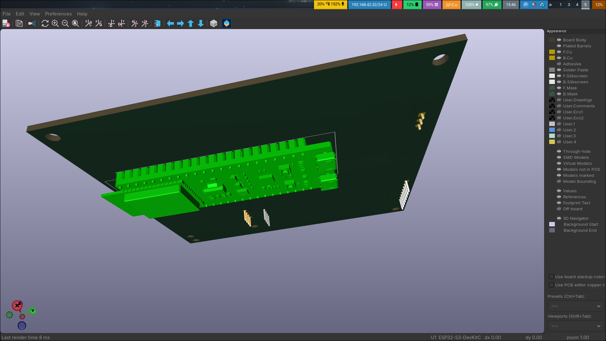

# SPACENOTIFY
SPACENOTIFY is a desktop dashboard that shows all space related activites including Launches, Landing and EVAs through the Launch Library 2 API.
# WHY
I designed SPACENOTIFY because I often can not look at my phone to check upcoming launches and I never want to miss one so this can sit on mydesk and as it has no controls can not be a distraction like a phone.
# Pictures

# BOM
| Name | Purpose | Quantity | Total Cost (USD) | Link | Distributor |
| --- | --- | --- | --- | --- | --- |
| Touch sensor | to allow UI interaction | 10 | 1.66 | https://www.aliexpress.us/item/3256806056841370.html?utparam-url=scene%3Asearch%7Cquery_from%3A%7Cx_object_id%3A1005006243156122%7C_p_origin_prod%3A&search_p4p_id=20260409181228570240878276160000137350_2 | Aliexpress |
| 1.8in LCD | Displays main info | 1 | 2.88 | https://www.aliexpress.us/item/3256805953674718.html?utparam-url=scene%3Asearch%7Cquery_from%3A%7Cx_object_id%3A1005006139989470%7C_p_origin_prod%3A | Aliexpress |
| PCB | Holds the display and esp32 | 1 | 5.00 |  | PCBWAY |
| ESP32S3 | Main MCU | 1 | 0.00 | https://www.aliexpress.us/item/3256806987456474.html?utparam-url=scene%3Asearch%7Cquery_from%3A%7Cx_object_id%3A1005007173771226%7C_p_origin_prod%3A | Aliexpress |
| I2c display | shows the info | 1 | 1.99 | https://www.aliexpress.us/item/3256805899077405.html?utparam-url=scene%3Asearch%7Cquery_from%3A%7Cx_object_id%3A1005006085392157%7C_p_origin_prod%3A&search_p4p_id=20260331193731576094732592880001235155_1 | Aliexpress |